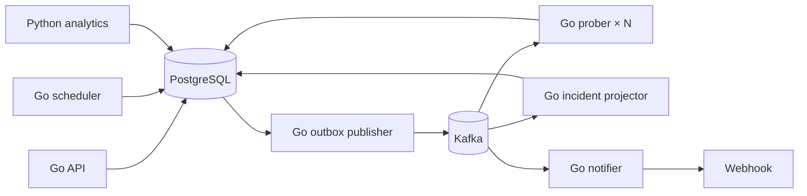

# PulseWatch

PulseWatch проверяет HTTP-сервисы и TCP-порты, считает доступность, создаёт инциденты после нескольких ошибок подряд и отправляет вебхуки об отказе и восстановлении. Python анализирует историю задержек и отмечает устойчивое замедление.

## Как устроен поток



| Процесс | Ответственность |
|---|---|
| `api` | Мониторы, история, статистика, инциденты, статусы доставки. |
| `scheduler` | Выбирает мониторы, для которых наступило время проверки, и создаёт задания. Использует `FOR UPDATE SKIP LOCKED`. |
| `prober` | Читает задания из Kafka, выполняет HTTP/TCP-проверки и сохраняет результаты. Масштабируется несколькими экземплярами. |
| `projector` | Читает результаты, ведёт последовательность ошибок и открывает/закрывает инциденты. |
| `publisher` | Публикует сообщения из PostgreSQL outbox в Kafka. |
| `notifier` | Доставляет вебхуки с повторами; после пяти ошибок отмечает доставку как `dead_letter`. |
| `analytics` | Python сравнивает медиану пяти последних успешных проверок с предыдущими двадцатью. |

Три Kafka topic: `probe-jobs`, `check-results`, `incident-events`. Запись результата и события в outbox происходит в одной транзакции. Consumer подтверждает offset после записи в PostgreSQL. Повтор задания не создаёт вторую проверку; повтор результата не меняет инцидент второй раз. Неразбираемые сообщения сохраняются в `dead_letters`.

Сервисы запускаются отдельными процессами, но используют одну физическую PostgreSQL и общую схему. Это упрощение для локального запуска. Для строгой изоляции микросервисов нужны отдельные хранилища или схемы с разграничением доступа и отдельные read-модели API.

## Быстрый запуск

Нужен Docker с доступом к Docker Hub.

```sh
docker compose up --build -d
curl http://localhost:8080/healthz
sh scripts/demo.sh
```

`docker compose down` останавливает стенд, сохраняя данные. `docker compose down -v` удаляет volumes. Миграции сохраняют мониторы и историю старой версии PulseWatch. API доступен на `localhost:8080`, тестовый приёмник вебхуков — на `localhost:8081/events`.

### Добавить HTTP-монитор

```sh
curl -X POST http://localhost:8080/monitors \
  -H 'Content-Type: application/json' \
  -d '{"name":"demo API","kind":"http","url":"http://demo-target:8000/","interval_seconds":10,"timeout_ms":2000,"failure_threshold":2}'
```

### Добавить TCP-монитор

```sh
curl -X POST http://localhost:8080/monitors \
  -H 'Content-Type: application/json' \
  -d '{"name":"postgres","kind":"tcp","url":"tcp://postgres:5432","interval_seconds":10,"timeout_ms":1000,"failure_threshold":3}'
```

У HTTP-монитора можно указать `expected_status`, например `418`. При значении `0` успешными считаются ответы 2xx и 3xx. Таймаут — 100–30000 мс, интервал — 10–3600 секунд, порог отказа — 1–10 последовательных ошибок.

### Посмотреть результат

```sh
curl http://localhost:8080/monitors
curl 'http://localhost:8080/monitors/1/checks?limit=10'
curl http://localhost:8080/monitors/1/stats
curl http://localhost:8080/incidents
curl http://localhost:8080/deliveries
curl http://localhost:8080/anomalies
curl http://localhost:8081/events
```

Статистика за 24 часа содержит число проверок, долю успешных ответов, среднюю задержку и p95. `GET /dead-letters` показывает сообщения Kafka, которые не удалось разобрать.

### Управлять монитором

```sh
curl -X PATCH http://localhost:8080/monitors/1/enabled \
  -H 'Content-Type: application/json' -d '{"enabled":false}'
curl -X PATCH http://localhost:8080/monitors/1/enabled \
  -H 'Content-Type: application/json' -d '{"enabled":true}'
curl -X POST http://localhost:8080/monitors/1/run
```

`PUT /monitors/{id}` заменяет настройки, `DELETE /monitors/{id}` удаляет монитор. Если задана переменная `API_KEY`, все маршруты кроме `/healthz` требуют заголовок `X-API-Key`.

### Проверить инцидент вручную

```sh
docker compose stop demo-target
sleep 25
curl http://localhost:8080/incidents
curl http://localhost:8081/events
docker compose start demo-target
sleep 15
curl http://localhost:8080/incidents
```

## Разработка и тесты

```sh
cd go && go test ./... && go vet ./...
cd ../python && python -m unittest discover -v
cd .. && sh scripts/integration.sh
```

Интеграционный сценарий запускает Compose, проверяет HTTP и TCP, открытие/закрытие инцидента, доставку вебхука, статистику и паузу монитора. GitHub Actions выполняет тесты и этот сценарий при push и pull request. Для масштабирования исполнителей: `docker compose up -d --scale prober=2`.

Схема меняется миграциями в `go/internal/db/migrations`. Запросы написаны явно через `database/sql` и драйвер pgx: блокировки, upsert и агрегаты легче проверить в SQL, чем спрятать за ORM.

## Kubernetes

Манифесты в `k8s/` рассчитаны на внешние PostgreSQL и Kafka. Нужно опубликовать два образа, заменить `ghcr.io/your-user/...` и адреса в ConfigMap, создать Secret `pulsewatch-db` с `DATABASE_URL` и Secret `pulsewatch-api` с `API_KEY`. Применяйте файлы по порядку: `00-config.yaml`, `10-migrate.yaml`, дождитесь завершения Job, затем `20-services.yaml`. `prober` имеет две реплики, аналитика запускается как CronJob.

## Границы проекта

Локальный Compose по умолчанию не задаёт API-ключ и разрешает проверять внутренние адреса сети Docker. Не выставляйте API в интернет без обязательной аутентификации, ограничений целевых адресов и TLS. Манифесты Kubernetes — пример конфигурации; развёртывание в реальном кластере и публикация образов пока не автоматизированы.
